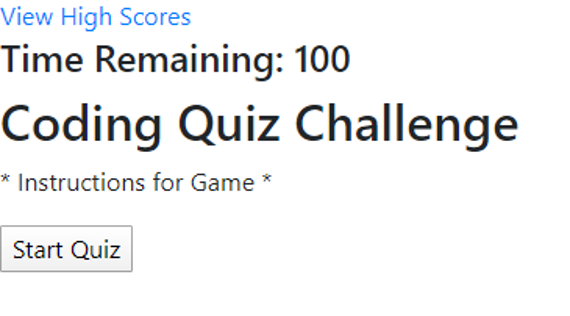
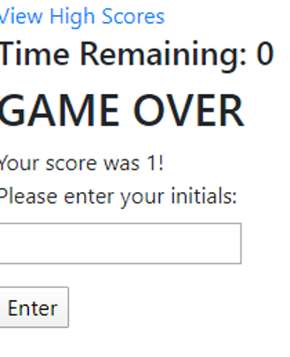
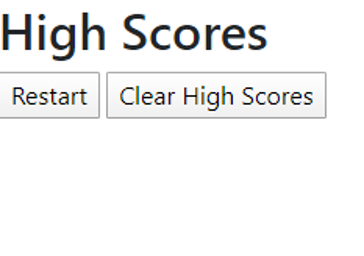

# 04 Web APIs: Code Quiz

## Description 
This application is for a Code Quiz using HTML, CSS, and JavaScript.

The initial code on HTML outlines the general structure of the quiz, with divs indicating the intro and quiz cards used. The intro div indicates intructions on the game, shows the timer, and has a Start button.
  
Upon clicking the start buttons, Javascript functions start workign in the background. I have the timer starting, Bootstrap hiding and reveal the two divs, and then rendering questions into the quiz.
  
Running functions and onclick events on all the buttons and referencing them to the array of objects housing the correct answer indicator, I display whether the user is right or wrong. For right, I increase their score and move to the next question. For wrong, I decrease their time and move to the next question. Once the time runs out, the game is over. I swap back to the original div and add a form to it to collect the user's intials. I have also displayed their score on this page.
  
When the Enter button is clicked, the user is redirected to the highscore page. A work in progress. The user's intials and scores should be saved here, in local storage, the reset button should start the game over again, and the clear highscores button should clear the list/local storage.
 

## License
MIT License

Copyright (c) [2020] [DrakeDeMuyt]

Permission is hereby granted, free of charge, to any person obtaining a copy
of this software and associated documentation files (the "Software"), to deal
in the Software without restriction, including without limitation the rights
to use, copy, modify, merge, publish, distribute, sublicense, and/or sell
copies of the Software, and to permit persons to whom the Software is
furnished to do so, subject to the following conditions:

The above copyright notice and this permission notice shall be included in all
copies or substantial portions of the Software.

THE SOFTWARE IS PROVIDED "AS IS", WITHOUT WARRANTY OF ANY KIND, EXPRESS OR
IMPLIED, INCLUDING BUT NOT LIMITED TO THE WARRANTIES OF MERCHANTABILITY,
FITNESS FOR A PARTICULAR PURPOSE AND NONINFRINGEMENT. IN NO EVENT SHALL THE
AUTHORS OR COPYRIGHT HOLDERS BE LIABLE FOR ANY CLAIM, DAMAGES OR OTHER
LIABILITY, WHETHER IN AN ACTION OF CONTRACT, TORT OR OTHERWISE, ARISING FROM,
OUT OF OR IN CONNECTION WITH THE SOFTWARE OR THE USE OR OTHER DEALINGS IN THE
SOFTWARE.
